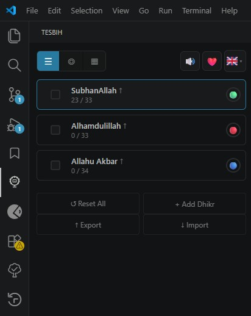
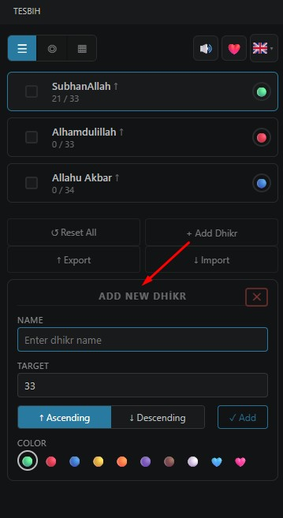
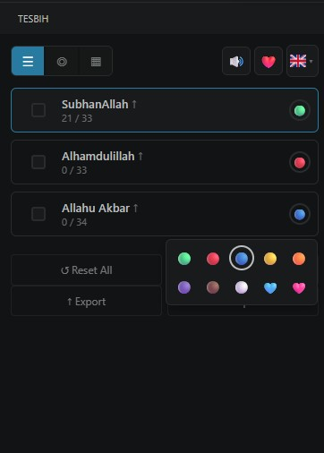
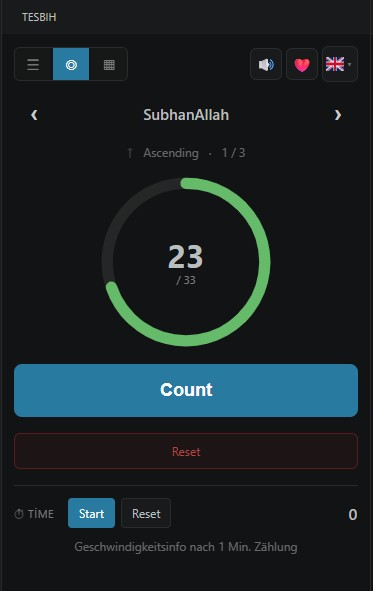
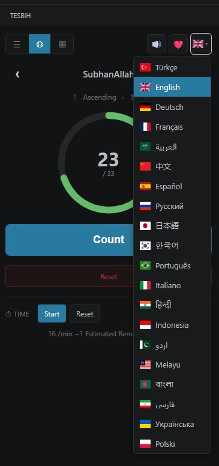
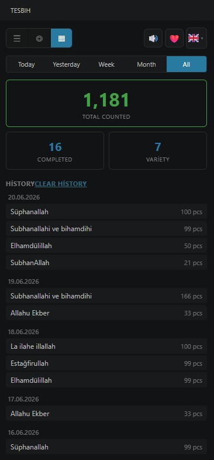

# Tesbih

**Digital prayer counter (tesbih/dhikr) for VS Code.**

Track your dhikr and tasbihat directly from your editor with a beautiful circular progress ring, multiple counters, statistics, and more.

## Features

- **Circular Progress Ring** — Visual feedback as you count toward your target
- **Multiple Counters** — Create and manage unlimited dhikr items
- **Ascending & Descending Modes** — Count up from 0 to target, or down from target to 0
- **Color Coding** — 10 colors to organize your dhikrs
- **Statistics & History** — Track your progress with daily, weekly, and monthly stats
- **Sound Effects** — Audio feedback on each count and completion
- **Keyboard Shortcut** — Press `Alt+T` to count without leaving your keyboard
- **Timer** — Built-in stopwatch with speed estimation
- **Drag & Drop** — Reorder items easily
- **Export / Import** — Backup and restore your data as JSON
- **20+ Languages** — Turkish, English, German, French, Arabic, Chinese, Spanish, Russian, Japanese, Korean, Portuguese, Italian, Hindi, Indonesian, Urdu, Malay, Bengali, Persian, Ukrainian, Polish
- **Confetti Animation** — Celebrate when you complete a dhikr

## Usage

1. Click the **Tesbih** icon in the Activity Bar
2. Start counting by clicking the button or pressing `Alt+T`
3. Add new dhikrs, customize colors, and track your progress

## Commands

| Command | Shortcut |
|---------|----------|
| Tesbih: Count (+1) | `Alt+T` |
| Tesbih: Reset Current | Command Palette |

## Screenshots

## Sponsor

If you find this extension helpful, consider supporting its development:

## License

[MIT](LICENSE)
